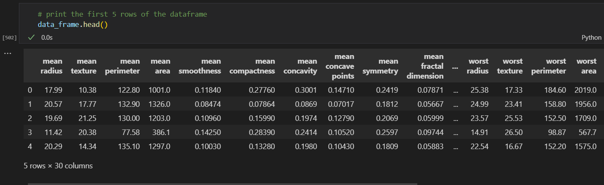
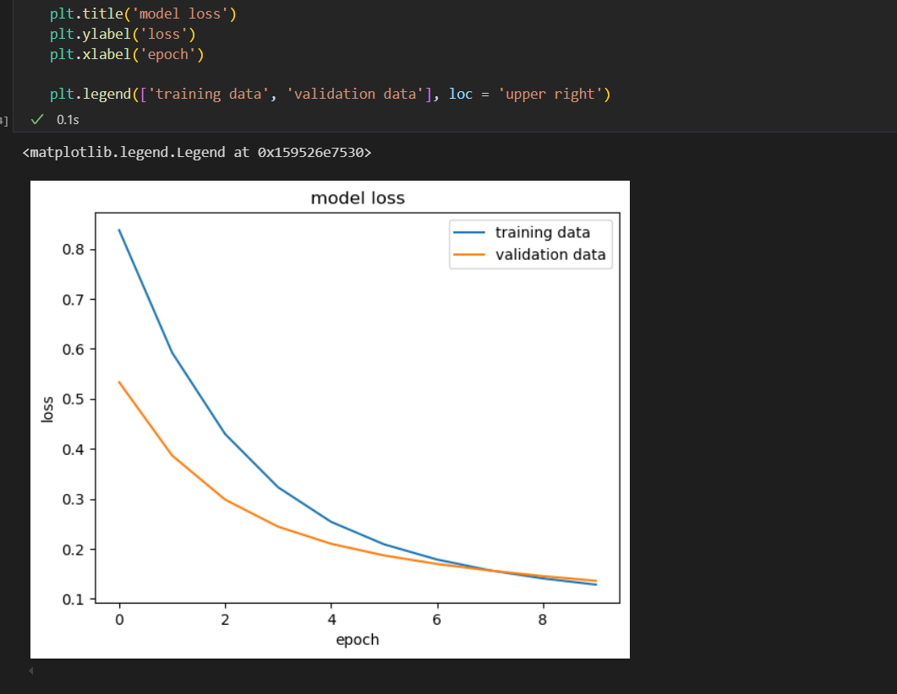
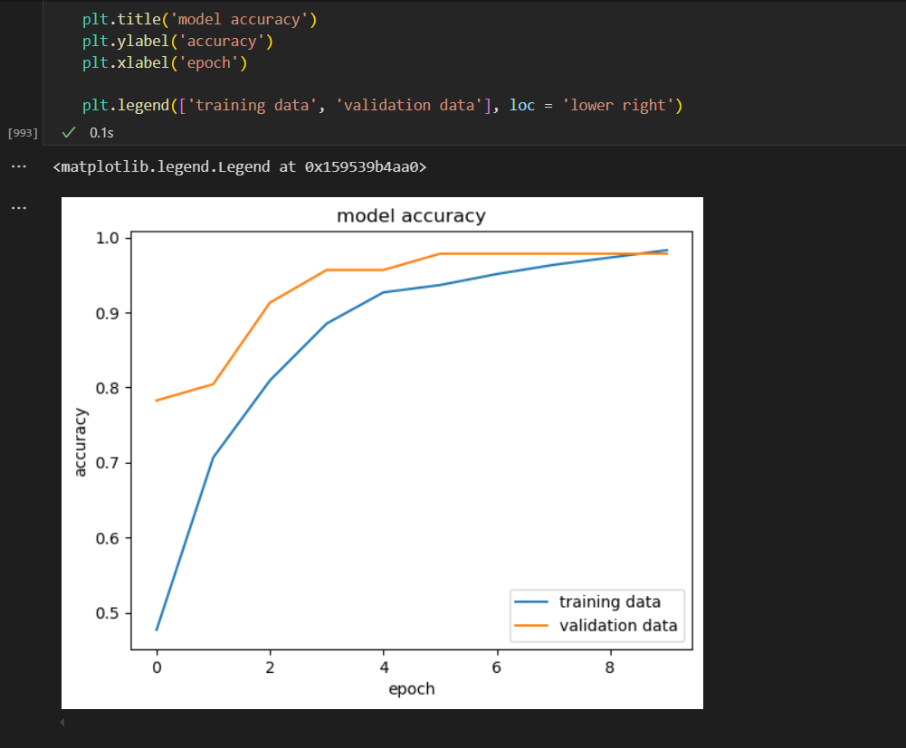
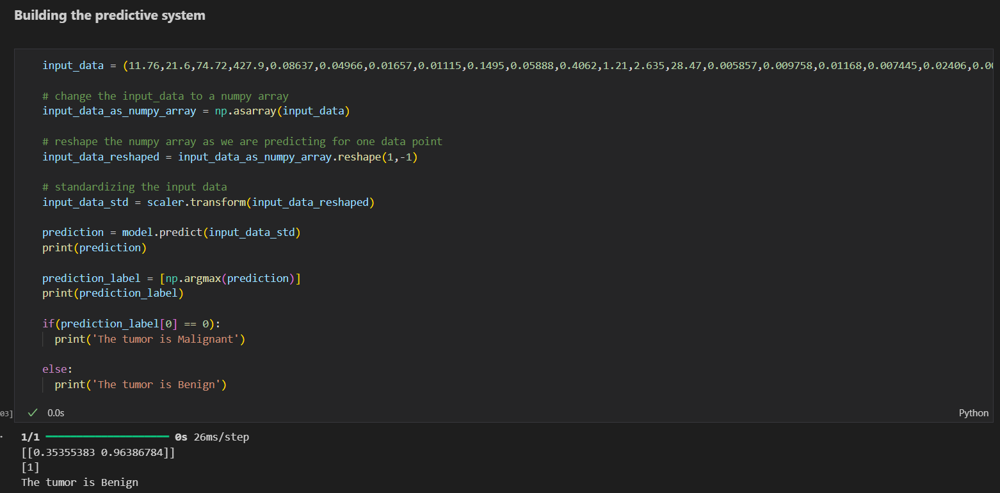

# 🎗️ Breast Cancer Classification Using Neural Network

This project implements a **Neural Network** for **breast cancer classification**, achieving an impressive **98% accuracy** on the test set. Built using Python and deep learning frameworks, it classifies breast cancer cases as malignant or benign based on features from the Wisconsin Breast Cancer Dataset (or similar). The project demonstrates the power of neural networks in medical diagnostics, with a focus on simplicity and high performance.

---

## 📸 Preview


---



---



---



---

## 📌 Features

- ✅ Classifies breast cancer cases as *malignant* or *benign* with **98% accuracy**
- ✅ Neural network model built with [TensorFlow/Keras or PyTorch]
- ✅ Data preprocessing: normalization, feature scaling, and handling missing values
- ✅ CLI or Jupyter Notebook interface for training and evaluation

---

## 🧠 How It Works

### 📍 Dataset
- Utilizes the [Wisconsin Breast Cancer Dataset](https://archive.ics.uci.edu/ml/datasets/Breast+Cancer+Wisconsin+(Diagnostic)) (or similar).
- Features include cell characteristics (e.g., clump thickness, cell size, shape).
- Binary classification: Malignant (1) or Benign (0).

### 🛠 Neural Network Architecture
- **Input Layer**: Matches the number of features in the dataset (e.g., 30 features).
- **Hidden Layers**: Fully connected layers with ReLU activation and dropout for regularization.
- **Output Layer**: Single neuron with sigmoid activation for binary classification.
- **Optimizer**: Adam or SGD with learning rate scheduling.
- **Loss Function**: Binary Cross-Entropy.

### 📊 Training
- Data split: 70% training, 15% validation, 15% test.
- Preprocessing: Standardization of features (mean=0, std=1).
- Achieved **98% test accuracy** after hyperparameter tuning (e.g., learning rate, number of layers, neurons).

---

## 🛠 Tech Stack

| Component         | Technology                                    |
|-------------------|-----------------------------------------------|
| **Language**      | Python                                       |
| **Framework**     | TensorFlow/Keras or PyTorch                  |
| **Libraries**     | NumPy, Pandas, Scikit-learn, Matplotlib, Seaborn |
| **Environment**   | Jupyter Notebook or Python scripts            |
| **Dataset**       | Wisconsin Breast Cancer Dataset (or similar)  |

---

## ⚙ Setup & Installation

### 📝 Prerequisites
- Python 3.8+
- pip or conda for package management
- Git
- Optional: Jupyter Notebook for interactive execution

### 📁 Clone the Repository
```bash
git clone https://github.com/utkarshsonpipre/BREAST-CANCER-MODEL-USING-NEURAL-NETWORKS
```

### 🛠 Install Dependencies
1. Create a virtual environment (optional but recommended):
   ```bash
   python -m venv venv
   source venv/bin/activate  # On Windows: venv\Scripts\activate
   ```
2. Install required packages:
   ```bash
   pip install -r requirements.txt
   ```


### 📊 Dataset Setup
- Download the Wisconsin Breast Cancer Dataset (e.g., via `scikit-learn` or UCI repository).
- Place the dataset file (e.g., `data.csv`) in the `data/` folder, or use the script to fetch it automatically.

### 🚀 Run the Project
1. Train the model:
   ```bash
   python train.py
   ```
   *OR* run the Jupyter Notebook:
   ```bash
   jupyter notebook Breast_Cancer_Classification.ipynb
   ```
2. Evaluate the model:
   - Outputs include accuracy, confusion matrix, and ROC curve visualizations.
   - Saved model weights are stored in `models/model.h5` (for Keras) or `models/model.pth` (for PyTorch).

---

## 📂 Project Structure

```
Breast-Cancer-Classification/
├── data.csv/                       # Dataset files (e.g., breast_cancer.csv)
├── models/                         # Saved model weights
├── notebooks/                      # Jupyter Notebooks
│   └── Breast_Cancer_Classification.ipynb
